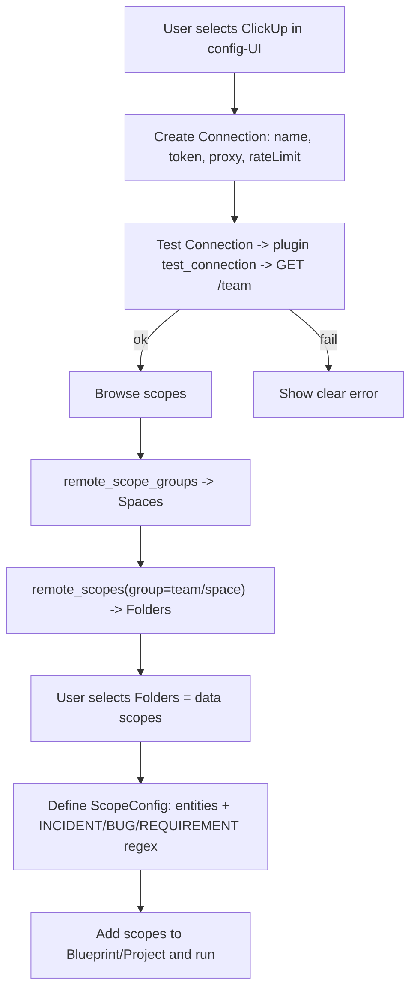
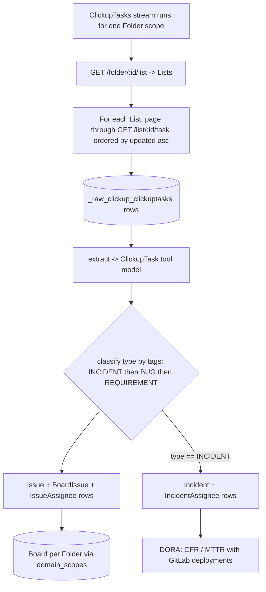
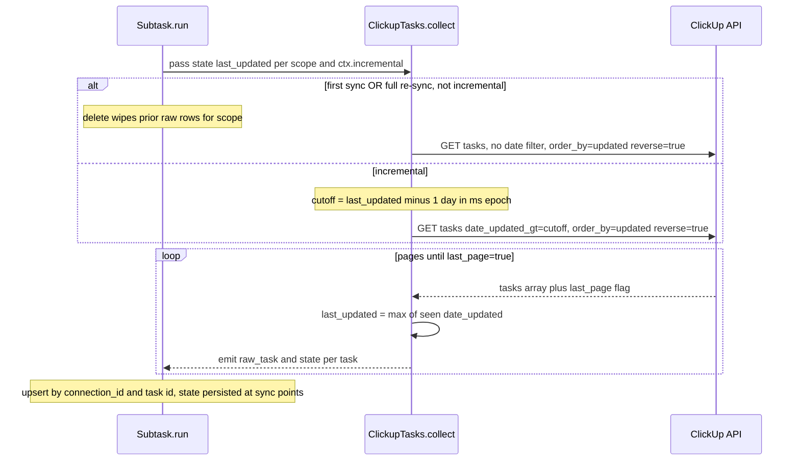

# Tech Design Specification — ClickUp Python Plugin

> Requirements: [requirements_spec.md](./requirements_spec.md) · [initial_user_requirements.md](./initial_user_requirements.md)
> Business rules referenced below by REQ-id live in the requirements spec; this document
> does not duplicate them.

## 1.1 Overview

A new **Python (pydevlake) data-source plugin** named `clickup` that collects ClickUp
tasks and converts them into DevLake domain entities:

- Every ClickUp task → a DevLake **Issue** (REQ-3).
- Tasks classified as `INCIDENT` (by tag regex) → additionally a DevLake **Incident**
  consumed by DORA alongside GitLab deployments (REQ-4, REQ-5).
- Each selected ClickUp **Folder** → one DevLake **Board** (REQ-2).

The plugin lives at `backend/python/plugins/clickup/` and follows the same structure as
the only existing Python plugin, `azuredevops`. It is the **first** Python plugin to emit
`TICKET` / incident domain entities, so it also adds a reusable
`pydevlake/domain_layer/ticket.py` module (mirroring the existing `code.py` /
`crossdomain.py`), mapping to the Go-defined tables `issues`, `incidents`, `boards`,
`board_issues`, `issue_assignees`, `incident_assignees`.

Config-UI registration (REQ-8) adds `config-ui/src/plugins/register/clickup/`.

### Confirmed design decisions

| Decision | Choice | Rationale |
| --- | --- | --- |
| Incremental key | **`date_updated`** + 1-day overlap | REQ-6; single pass captures new + edited tasks. |
| Scope unit | **Folder only** | Matches REQ-2; folderless lists are a documented limitation. |
| Incident production | **Plugin emits Incident directly** (webhook-style) | Self-contained; incidents exist without a DORA run. |
| People modeling | **Inline ids/names + `*_assignees` join tables** | Matches webhook plugin; sufficient for DORA. No Account stream. |

## 1.2 Flow Logic

### A. Setup flow (config-UI → plugin CLI), REQ-1, REQ-2, REQ-7



### B. Collection / conversion flow per scope (Folder), REQ-3..REQ-6



### C. Incremental collection (sequence), REQ-6



### Error handling

- **Backend (plugin):** `APIException` raised by the `handle_error` response hook on HTTP
  ≥ 400; `test_connection` maps 401 → "Invalid token". HTTP 429 is handled transparently
  by the framework `pause_if_too_many_requests` hook (sleeps `Retry-After`, retries).
- **Frontend (config-UI):** standard connection-form validation (required token/name) and
  the standard test-connection result surface backend errors.

## 1.3 Validation & Business Logic

| Concern | Logic | Source |
| --- | --- | --- |
| **Type classification** | Compile `incident`/`bug`/`requirement` regex from ScopeConfig; match (case-insensitive) against task tag names; precedence INCIDENT > BUG > REQUIREMENT; default REQUIREMENT. | REQ-4 |
| **Status mapping** | ClickUp `status.type`: `open`→`TODO`; `custom`/in-progress→`IN_PROGRESS`; `closed`/`done`→`DONE`; else `OTHER`. Preserve `status.status` as `original_status`. | REQ-3.3, assumption 1 |
| **Resolution date** | `date_done` (fallback `date_closed`). | assumption 2 |
| **Lead time** | If `date_done` set: `lead_time_minutes = (date_done - date_created)/60`. | REQ-3.4 |
| **Incremental cutoff** | `date_updated_gt = (state.last_updated_ms - 86_400_000)`; high-water mark = `max(date_updated)`. Empty state ⇒ full collection. | REQ-6 |
| **Issue key** | `custom_id` when present, else task `id`. | assumption 4 |
| **Incident determination** | `issue.type == "INCIDENT"`. | REQ-5 |
| **Patterns empty** | No regex ⇒ all tasks REQUIREMENT, no incidents. | REQ-4 alt-4a |

Case-insensitivity is achieved by compiling with `re.IGNORECASE`.

## 1.4 API Contracts

### ClickUp REST API (consumed), base `https://api.clickup.com/api/v2`

Auth: header `Authorization: <personal_token>` (no Bearer prefix). Pagination: `page`
(0-indexed), 100 tasks/page, response field `last_page: bool`.

| Purpose | Endpoint | Used by |
| --- | --- | --- |
| Verify token / list workspaces | `GET /team` | `test_connection`, `remote_scope_groups` |
| List spaces in a workspace | `GET /team/{team_id}/space` | `remote_scope_groups` |
| List folders in a space | `GET /space/{space_id}/folder` | `remote_scopes` |
| List lists in a folder | `GET /folder/{folder_id}/list` | `ClickupTasks.collect` |
| List tasks in a list | `GET /list/{list_id}/task?order_by=updated&reverse=true&include_closed=true&subtasks=true&page={n}&date_updated_gt={ms}` | `ClickupTasks.collect` |

### Plugin CLI interface (pydevlake, via `fire`)

Exposed by `Plugin.start()`: `plugin_info`, `test_connection`, `remote_scope_groups`,
`remote_scopes`, `collect`, `extract`, `convert`. No new protocol — identical to
`azuredevops`.

### Errors

Raised as `pydevlake.api.APIException` wrapping the `Response`. `test_connection` returns a
`TestConnectionResult`. Representative cases:

```
{ id: "clickup_invalid_token", params: {"status": 401}, description: "Invalid ClickUp personal API token" }
{ id: "clickup_rate_limited",  params: {"retry_after": 60}, description: "ClickUp rate limit hit; retrying" }
```

## 1.5 Data Models

All models are pydevlake/SQLModel classes. **Tool models** persist to
`_tool_clickup_*` tables; **domain models** persist to the shared DevLake domain tables.

### Connection, Scope, ScopeConfig (`clickup/models.py`)

```python
import re
from typing import Optional
from pydantic import SecretStr
from pydevlake import Connection, ScopeConfig, ToolScope, ToolModel, Field
from pydevlake.model import DomainType


class ClickUpConnection(Connection):
    token: SecretStr                 # personal API token
    endpoint: Optional[str] = "https://api.clickup.com/api/v2"
    rate_limit_per_hour: Optional[int] = 6000   # ~100/min default


class ClickUpScopeConfig(ScopeConfig):
    # domain_types inherited (alias "entities"); default to TICKET + CROSS
    issue_type_incident: Optional[re.Pattern]
    issue_type_bug: Optional[re.Pattern]
    issue_type_requirement: Optional[re.Pattern]


class ClickUpFolder(ToolScope, table=True):
    # ToolScope provides: id (pk), name, scope_config_id, connection_id (pk)
    space_id: str
    space_name: Optional[str]
    team_id: str
```

### Tool model (`clickup/models.py`) — maps the ClickUp task JSON

```python
import datetime

class ClickUpTask(ToolModel, table=True):
    id: str = Field(primary_key=True)
    custom_id: Optional[str]
    name: str
    text_content: Optional[str]
    description: Optional[str]
    status: Optional[str]            = Field(source='/status/status')
    status_type: Optional[str]       = Field(source='/status/type')
    date_created: Optional[datetime.datetime]
    date_updated: Optional[datetime.datetime]
    date_closed: Optional[datetime.datetime]
    date_done: Optional[datetime.datetime]
    creator_id: Optional[str]        = Field(source='/creator/id')
    creator_name: Optional[str]      = Field(source='/creator/username')
    priority: Optional[str]          = Field(source='/priority/priority')
    url: Optional[str]
    parent: Optional[str]            # parent task id (subtasks)
    list_id: str                     = Field(source='/list/id')
    folder_id: str                   = Field(source='/folder/id')
    tags: list[dict] = []            # [{"name": ...}, ...]
    assignees: list[dict] = []       # [{"id":..., "username":...}, ...]
```

> ClickUp date fields arrive as **epoch-millisecond strings**; a `@validator` converts them
> to `datetime` during extraction.

### Domain models — NEW `pydevlake/domain_layer/ticket.py`

These mirror the Go domain structs and map to existing tables (no new tables created by
the plugin; the Go core owns the schema). Only fields the plugin populates are shown.

```python
from datetime import datetime
from typing import Optional
from sqlmodel import Field
from pydevlake.model import DomainModel, DomainScope, NoPKModel

# constants
BUG, REQUIREMENT, INCIDENT, TASK, SUBTASK = "BUG", "REQUIREMENT", "INCIDENT", "TASK", "SUBTASK"
TODO, IN_PROGRESS, DONE, OTHER = "TODO", "IN_PROGRESS", "DONE", "OTHER"


class Board(DomainScope, table=True):
    __tablename__ = "boards"
    name: str
    description: Optional[str]
    url: Optional[str]
    created_date: Optional[datetime]
    type: Optional[str]


class Issue(DomainModel, table=True):
    __tablename__ = "issues"
    url: Optional[str]
    issue_key: str
    title: str
    description: Optional[str]
    type: str                         # INCIDENT | BUG | REQUIREMENT
    original_type: Optional[str]
    status: str                       # TODO | IN_PROGRESS | DONE | OTHER
    original_status: Optional[str]
    created_date: Optional[datetime]
    updated_date: Optional[datetime]
    resolution_date: Optional[datetime]
    lead_time_minutes: Optional[int]
    creator_id: Optional[str]
    creator_name: Optional[str]
    assignee_id: Optional[str]
    assignee_name: Optional[str]
    parent_issue_id: Optional[str]
    priority: Optional[str]
    is_subtask: bool = False


class BoardIssue(NoPKModel, table=True):
    __tablename__ = "board_issues"
    board_id: str = Field(primary_key=True)
    issue_id: str = Field(primary_key=True)


class IssueAssignee(NoPKModel, table=True):
    __tablename__ = "issue_assignees"
    issue_id: str = Field(primary_key=True)
    assignee_id: str = Field(primary_key=True)
    assignee_name: Optional[str]


class Incident(DomainModel, table=True):
    __tablename__ = "incidents"
    url: Optional[str]
    incident_key: str
    title: str
    description: Optional[str]
    status: str
    original_status: Optional[str]
    created_date: Optional[datetime]
    updated_date: Optional[datetime]
    resolution_date: Optional[datetime]
    lead_time_minutes: Optional[int]    # MTTR input for DORA
    creator_id: Optional[str]
    creator_name: Optional[str]
    assignee_id: Optional[str]
    assignee_name: Optional[str]
    parent_incident_id: Optional[str]
    priority: Optional[str]
    table: str = Field(default="boards")   # incident.table -> "boards"
    scope_id: str                          # board id (Folder)


class IncidentAssignee(NoPKModel, table=True):
    __tablename__ = "incident_assignees"
    incident_id: str = Field(primary_key=True)
    assignee_id: str = Field(primary_key=True)
    assignee_name: Optional[str]
```

> `Incident.table` + `Incident.scope_id` are what DORA's `ConnectIncidentToDeployment`
> joins on (via `project_mapping`); `created_date`/`resolution_date`/`lead_time_minutes`
> drive CFR and MTTR.

### Plugin & stream wiring (`clickup/main.py`, `clickup/streams/tasks.py`)

```python
class ClickUpPlugin(Plugin):
    connection_type   = ClickUpConnection
    tool_scope_type   = ClickUpFolder
    scope_config_type = ClickUpScopeConfig

    def test_connection(self, connection): ...        # GET /team
    def remote_scope_groups(self, connection): ...    # -> RemoteScopeGroup(id="team/space")
    def remote_scopes(self, connection, group_id): ...# -> [ClickUpFolder]
    def domain_scopes(self, folder):                  # -> yield Board(per Folder)
        ...
    @property
    def streams(self): return [ClickupTasks]


class ClickupTasks(Stream):
    tool_model    = ClickUpTask
    domain_types  = [DomainType.TICKET, DomainType.CROSS]
    domain_models = [Issue, BoardIssue, IssueAssignee, Incident, IncidentAssignee]

    def collect(self, state, context):  # lists -> paged tasks, incremental + overlap
        ...
    def convert(self, task: ClickUpTask, ctx):
        # classify type, map status, build Issue(+BoardIssue,+IssueAssignee);
        # if type == INCIDENT also yield Incident(+IncidentAssignee)
        ...
```

Domain-entity ids use the framework helper `domain_id(ClickUpTask, connection_id, task.id)`
→ `clickup:ClickUpTask:<cid>:<task_id>`; Board id derives from the Folder scope.

## 1.6 Automated Tests

- **Unit (pytest, in `plugins/clickup/tests/`)** — mirror `azuredevops/tests/streams_test.py`:
  - `extract`: ClickUp task JSON → `ClickUpTask` (epoch-ms date parsing, nested `source`
    pointers, missing optional fields).
  - Type classification: precedence INCIDENT > BUG > REQUIREMENT, case-insensitive, empty
    patterns → REQUIREMENT (REQ-4).
  - Status mapping table (REQ-3.3); lead-time computation (REQ-3.4).
  - `convert`: incident tasks yield both Issue and Incident with matching ids/board scope.
  - Incremental cutoff: `date_updated_gt` = last_updated − 1 day; high-water mark update.
- **Integration** — `test_connection`, `remote_scope_groups`, `remote_scopes` against
  recorded ClickUp responses (fixtures), asserting 401 → invalid-token result.
- **E2E (config-UI, Playwright)** — register plugin, create connection, browse Space→Folder,
  define scope config patterns, add to a blueprint, run, verify outcome surface (REQ-8).

## 1.7 Infrastructure

- New plugin dir ships `pyproject.toml`, `build.sh`, `run.sh` (copied from `azuredevops`,
  `pydevlake = { path = "../../pydevlake", develop = true }`). No new external services.
- The Python plugin runner / Docker image already discovers `backend/python/plugins/*`; no
  CI topology change beyond the new package being built.
- **Logging:** use `pydevlake.logger`; log incremental cutoff, page counts, and the
  documented deleted-task limitation note on full re-sync.

## 1.9 Migration Scripts

`clickup/migrations.py` with a `@migration(<ts>, name="initialize schemas for ClickUp")`
that `b.create_tables(...)` for **tool tables only**: `ClickUpConnection`,
`ClickUpScopeConfig`, `ClickUpFolder`, `ClickUpTask`. Domain tables (`issues`, `incidents`,
`boards`, `board_issues`, `issue_assignees`, `incident_assignees`) are owned by the Go core
migrations and **must not** be created here. Follow the azuredevops convention (entities
column as `json`, `connection_id`, `scope_config_id`).

## 2.1 UI/UX (config-UI)

New `config-ui/src/plugins/register/clickup/`:

- `config.tsx` — `IPluginConfig`: `plugin:'clickup'`, `name:'ClickUp'`, SVG icon, `sort`,
  connection fields `['name', token, 'proxy', rateLimitPerHour]`,
  `dataScope: { title:'Folders', millerColumn:{ columnCount:2, firstColumnTitle:'Spaces' } }`,
  `scopeConfig: { entities:['TICKET','CROSS'], transformation:{ issueTypeIncident, issueTypeBug, issueTypeRequirement } }`.
- `transformation.tsx` — Collapse panel with the three regex inputs (pattern mirrors
  `asana`/`linear`), wired into `scope-config-form/index.tsx` via `plugin === 'clickup'`.
- `assets/icon.svg`; `index.ts` re-exports; register `ClickUpConfig` in
  `register/index.ts`.

Reuse built-in connection field components (`token`, `proxy`, `rateLimitPerHour`, `name`)
and the standard data-scope miller-column browser. No custom data-scope render needed.

## 2.2 Technical Stack

- **Backend:** Python ~3.9, pydevlake, SQLModel/Pydantic, `fire` CLI, `requests` (all via
  pydevlake). Token pagination via a custom `ClickUpPaginator` (`page` + `last_page`).
- **Frontend:** existing config-UI React/AntD stack; no new libraries.

## 2.3 Code Structure Guidelines

```
backend/python/plugins/clickup/
├── clickup/
│   ├── main.py            # ClickUpPlugin
│   ├── api.py             # ClickUpAPI + ClickUpPaginator + auth/rate-limit hooks
│   ├── models.py          # Connection, ScopeConfig, ClickUpFolder, ClickUpTask
│   ├── migrations.py      # tool-table init migration
│   └── streams/
│       └── tasks.py       # ClickupTasks stream (collect/extract/convert)
├── tests/
├── pyproject.toml, build.sh, run.sh
backend/python/pydevlake/pydevlake/domain_layer/ticket.py   # NEW shared module
config-ui/src/plugins/register/clickup/                      # UI registration
```

Mirror `azuredevops` naming and structure. Add `ticket` to
`pydevlake/domain_layer/__init__.py` exports.

## 2.5 References

- Requirements: [requirements_spec.md](./requirements_spec.md),
  [initial_user_requirements.md](./initial_user_requirements.md)
- Reference implementations in-repo: `backend/python/plugins/azuredevops` (plugin pattern),
  `backend/plugins/linear` (tag→type regex classification),
  `backend/plugins/webhook/api/issues.go` (Issue→Incident derivation),
  `backend/plugins/dora` (incident→deployment correlation for CFR/MTTR).
- ClickUp API: `GET tasks` — https://developer.clickup.com/reference/gettasks
- DevLake plugin guide: https://devlake.apache.org/docs/DeveloperManuals/PluginImplementation
